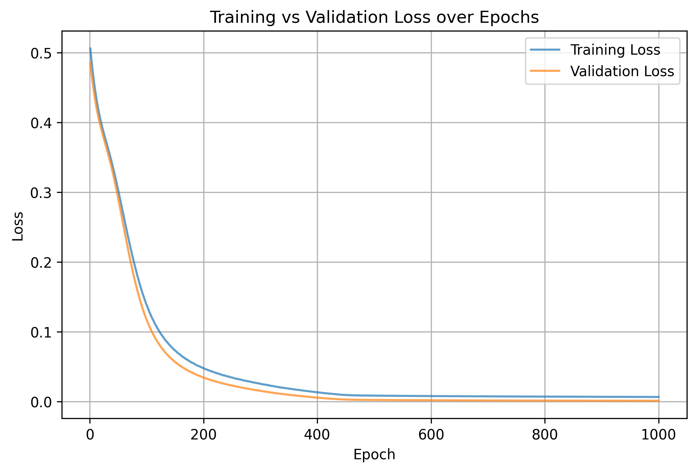
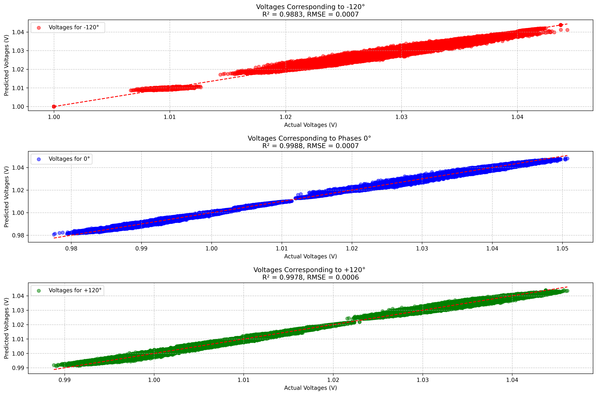

# Power System Voltage and Power Flow Prediction using Neural Networks and Clustering

## Project Overview
This research project develops an advanced machine learning approach for predicting voltage magnitudes and power flows in electrical power systems using neural networks and intelligent clustering techniques.

## Key Features
- Multi-phase power system voltage prediction
- Advanced neural network architecture
- Intelligent clustering of power system nodes
- Complex power flow calculations

## Methodology

### Data Preprocessing
- Voltage magnitude and phase processing
- Admittance matrix handling
- Feature normalization techniques

### Neural Network Architecture
- Custom neural network design
- Dropout and regularization techniques
- Multiple hidden layer configuration

### Clustering Approach
- Node clustering based on electrical characteristics
- Identification of electrically similar groups
- Inter-cluster power flow analysis

## Key Graphs and Visualizations

### 1. Training Loss Curves

- Demonstrates model learning progress
- Shows convergence of training and validation loss

### 2. Voltage Prediction Scatter Plot

- Actual vs. Predicted voltage magnitudes
- R² and RMSE metrics

### 3. Power Flow Visualization

- Spatial representation of power flow
- Different colors for different clusters

### 4. Node Clustering Diagram

- Visualization of node clusters
- Electrical connectivity representation

## Performance Metrics
- Mean Squared Error (MSE)
- R² Score
- Mean Absolute Error (MAE)

## Dependencies
- Python 3.8+
- PyTorch
- NumPy
- Pandas
- Scikit-learn
- Matplotlib

## Usage
```bash
#Usage:
    # Load data
    input_df = pd.read_csv("power_flow_nn/cluster_in_1_withp.csv")
    output_df = pd.read_csv("power_flow_nn/cluster_out_1.csv")
    # Train the model and evaluate
    model, X_mean, X_std, voltage_min, voltage_range = train_and_evaluate_nn(
        input_df=input_df, 
        output_df=output_df,
        hidden_size=10
    )
    # Test prediction time
    test_prediction_time(
        model, 
        input_df.values, 
        X_mean, 
        X_std, 
        voltage_min, 
        voltage_range
    )


```


## Future Work

- Incorporate more advanced clustering algorithms
- Explore ensemble neural network approaches
- Develop real-time power system prediction models
